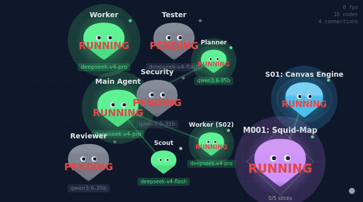

# squid-viz

A visualizer for GSD (Get Shit Done) projects — renders your milestones, slices, and tasks as an organic squid visualization on an HTML5 Canvas.



## Quick Start (2 minutes)

**Option A: Development** (if you're developing squid-viz):
```bash
# Terminal 1: Visualizer
git clone <this-repo>
cd <repo>
npm install
npm run dev    # HTTP on 5177, WebSocket on 5178

# Terminal 2: Your GSD project
gsd --extension /path/to/repo/.gsd/extensions/squid-snapshot-writer/index.js
```

**Option B: Production** (install globally):
```bash
# One-time setup
git clone <this-repo>
cd <repo>
npm install
npm run build
npm link

# Copy extension to global GSD (works for ALL your GSD projects on this machine)
cp -r .gsd/extensions/squid-snapshot-writer ~/.gsd/extensions/

# Add to ~/.zshrc
alias gsd-squid='gsd --extension ~/.gsd/extensions/squid-snapshot-writer/index.js'
source ~/.zshrc
```

### To visualize a project:

You need **two terminals**. Each terminal does a different thing:

**Terminal 1 — Start the UI server** (point it at the project you want to see):
```bash
squid-viz --gsd-dir /home/user/your-gsd-project
```

**Terminal 2 — Start the data push** (MUST be in the same project directory):
```bash
cd /home/user/your-gsd-project    # ← this is the project whose data you want
gsd-squid                          # ← this pushes data from THIS project
```

> ⚠️ **Both terminals must target the same project.** The `--gsd-dir` flag in Terminal 1 tells `squid-viz` which project to display. The `cd` in Terminal 2 tells `gsd-squid` which project to pull data from. If they don't match, you'll see a different project than expected.

## How It Works

- **WebSocket** on port 5178: GSD extension pushes data every 5 seconds
- **HTTP** on port 5177: Serves the Canvas UI
- **Fallback**: If no WebSocket server, extension writes to disk and browser polls (slower)

### Connection Indicator (bottom-right corner)
- 🟢 **Green**: WebSocket connected, real-time updates
- 🟡 **Yellow**: Polling fallback (squid-viz not running)
- 🔴 **Red**: Disconnected entirely

## Architecture

- **Frontend**: Native Canvas 2D API (no Pixi/D3/Three.js)
- **Data**: WebSocket streaming — GSD extension pushes directly
- **CLI**: Global `squid-viz` serves UI + WebSocket server

## Commands

```bash
squid-viz           # Default (ports 5177/5178)
squid-viz --port 3000 --ws-port 3001  # Custom ports
squid-viz --no-open  # Don't auto-open browser
```

## Development

```bash
npm run dev    # HMR + WebSocket
npm run build  # Production build
```

## Files

| Path | Purpose |
|------|---------|
| `bin/squid-viz` | CLI with WebSocket server |
| `vite.config.js` | Dev server + WebSocket plugin |
| `src/main.js` | Canvas + WebSocket client |
| `src/render/` | SquidNode, Tentacle, Scene |
| `.gsd/extensions/squid-snapshot-writer/` | GSD extension (WebSocket client) |

## Tech Stack

- Node.js 18+ • Vite • WebSocket (ws) • Native Canvas 2D